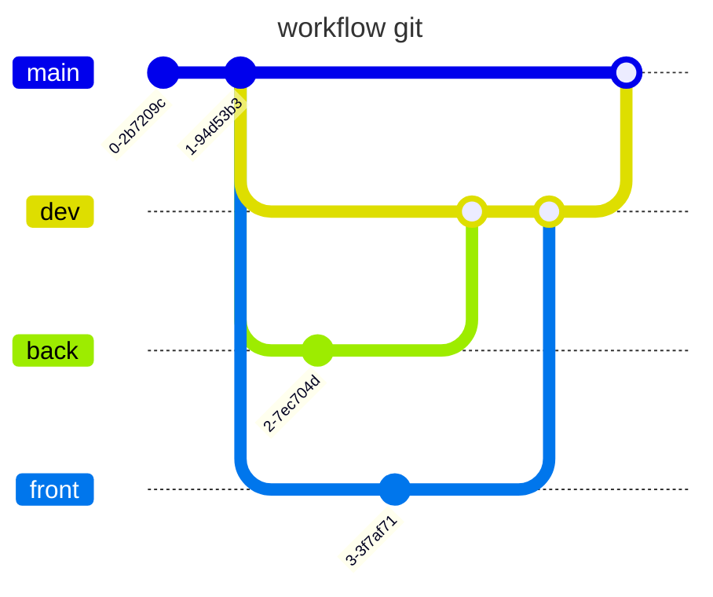
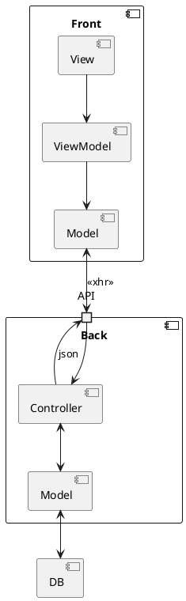
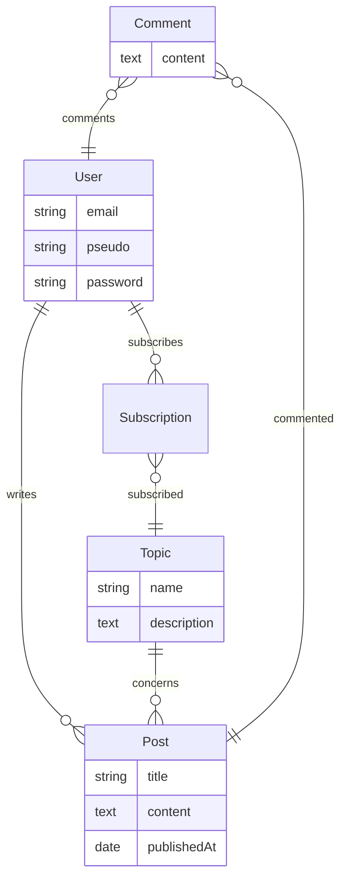

# Conception Monde de dev

## Présentation du projet

### Objectifs du projet

L'entreprise ORION souhaite créer un réseau social pour développeurs nommé Monde de Dev ( MDD ).

Nous commencerons par la réalisation d'un MVP déployé en interne.

## Entrants

- [spec fonctionnelles](./Specifications_fonctionnelles.pdf)
- [contraintes techniques](./Contraintes_techniques.pdf)
- [maquettes figma](https://www.figma.com/design/Rflr3TVBog35BNMnn0DF09/Maquettes-MDD--desktop-et-mobile-?node-id=0-1&p=f)

## Conception

### Diagramme UC

- ✅ fonctionnels
    - ✅ s'enregistrer
    - ✅ se connecter
    - ✅ se déconnecter
- gestion du profil
    - ✅ consulter son profil
    - ✅ modifier son profil
- gestion des thèmes
    - ✅ consulter les thèmes
    - ✅ s'abonner à un thème
    - se désabonner d'un thème ( sur la page de profil)
- fil d'actualité
    - ✅ consulter son fil d'actualité ( page d'accueil )
    - ✅ trier le fil d'actualité
- articles
    - ✅ ajouter un article
    - ✅ consulter un article
    - ✅ commenter un article

## Règles de gestions

Ajouter des tests automatisés pour valider ces points

- mots de passe
    - plus de 8 caractères
    - contient au moins
        - un chiffre
        - une lettre minuscule
        - une lettre majuscule
        - un caractère spécial `=+_-$#!?`
- ✅ ajout d'un article
    - ✅ l'auteur est défini
    - ✅ la date est définie
- ✅ ajout d'un commentaire
    - ✅ l'auteur est défini
    - ✅ la date est définie
- ✅ 1 commentaire correspond à un article
    - ✅ pas de réponses à un commentaire
- ✅ après le clic sur le bouton `S'abonner` le bouton devient inactif et le texte devient `Déjà abonné`

## Choix d'Architecture

### Git 

Une branche 

- `main` pour le code en production
- `dev` pour les tests
- `back` pour les dev back
- `front` pour les dev front

### Contraintes recensées

- ✅ Design responsive
- ✅ Client / Serveur
    - ✅ Back java / spring
        - ✅ préférer les modules spring
    - ✅ front typescript / angular
        - ✅ angular cli
- ✅ Interaction front / back sécurisé
- ✅ Respect des principes SOLID
- ✅ 1 seul repo pour tout le projet
- ✅ utiliser git et github

### Comparaison des différents types d'architectures

references : 

- [architecture mondays](https://www.developertoarchitect.com/lessons/) ep 158 > 166
- [Monolithique vs n-tiers vs microservice](https://www.youtube.com/watch?v=qbDkBPpmjJM)
- [types d'architectures](./architecture-styles-worksheet.pdf)

les besoins étant : 

- cout
- simplicité
- mise en place rapide

On choisit une architecture en couches.

La couche présentation étant le projet front, les autres couches sont dans le projet back.

### Schema de l'architecture

### Modelisation BDD

### Back

#### liste des routes API

Toutes les routes sont préfixées par `/api/v1/`
Seules les routes login et register ne sont pas protégés

| url | verbe http | description | remarques |
| --- | --- | --- | --- |
| ✅ auth/login | POST | log un utilisateur | un token d'authentification est renvoyé |
| ✅ auth/register | POST | enregistre un utilisateur | NA |
| ✅ me | GET | récupère les informations de l'utilisateur connecté | NA |
| ✅ me | PUT | modifie les informations de l'utilisateur connecté | NA |
| ✅ topic | GET | récupère la liste des thèmes | chaque topic contient un champ registered qui vaut true si l'utilisateur connecté est inscrit à ce topic |
| ✅ subscription/{topic_id}/ | POST | abonne l'utilisateur connecté au topic dont l'id est fourni | NA |
| ✅ subscription/{topic_id} | DELETE | désabonne l'utilisateur connecté au topic dont l'id est fourni | NA |
| ✅ feed?sort=ASC | GET | récupère les articles correspondant aux thèmes du profil | réponse triable en ajoutant le paramètre sort (DESC par défaut) |
| ✅ post | POST | ajoute un article | l'auteur est l'utilisateur connecté |
| ✅ post/{post_id} | GET | récupère les informations de l'article dont l'id est fourni | les commentaires sont à récupérés sur une autre route  |
| ✅ post/{post_id}/comment | GET | récupère la liste des commentaires pour l'article dont l'id est fourni  | NA |
| ✅ post/{post_id}/comment | POST | ajoute un commentaire sur l'article dont l'id est fourni. l'utilisateur du commentaire est l'utilisateur connecté | NA |

### Front

#### Liste des pages

| url | description | données affichées | endpoints utilisées | remarques |
| --- | --- | --- | --- | --- |
| ✅ / | page d'accueil | affiche des boutons `se connecter` et `s'inscrire` | NA | Si l'utilisateur est connecté, redirige vers `/feed` |
| ✅ /register | page de création de compte | affiche le formulaire | les données sont envoyées sur `register` | --- |
| ✅ /login | page de connexion | affiche le formulaire | les données sont envoyées sur `login` | --- |
| ✅ /logout | bouton de déconnexion | NA | NA | l'utilisateur est redirigé sur la page de `home` |
| ✅ /feed | page d'accueil | affiche le fil d'actualité | `feed` | l'utilisateur peut trier le fil par date |
| ✅ /themes | liste des thèmes | affiche tous les thèmes disponibles sur le site | `topic` | l'utilisateur peut s'abonner  à un thème depuis cette page |
| ✅ /me | infos utilisateurs | affiche les infos de l'utilisateur connecté dans un formulaire ainsi que les thèmes auxquels il est abonné | `me` | l'utilisateur peut modifier son profil les données sont envoyées en POST sur le endpoint `me`, il peut également se désabonner aux thèmes |
| ✅ /article/{id_article} | details d'un article | affiche les infos de l'article dont l'id est fourni dans l'url, affiche également le formulaire d'ajout de commentaires | `post/{post_id}`, `post/{post_id}/comment` le formulaire est envoyé en POST sur `post/{post_id}/comment` |  |
| ✅ /article/nouveau | page de création d'un article | affiche un formulaire de création d'article | le formulaire est envoyé en POST sur `/post` |  |

#### Liste des composants

- ✅ Menu
- ✅ Bouton
- ✅ Article

## Utilisations de l'IA

### Back

- génération de la configuration à mysql
    - `connect this app to the mysql database mdd_user:mdd_pwd@p05_mdd`
    - màj de `application.properties`
- génération du script du schema de BDD
    - `generate mysql script to match the mermaid diagram`
    - génération de `schema.sql`

## TODO

- permettre de se connecter avec l'email OU le pseudo
- ✅ filtrer les articles du feed par date croissante ou décroissante

## Amélioration envisagées

- pagination du fil d'actualité et de la liste des commentaires
