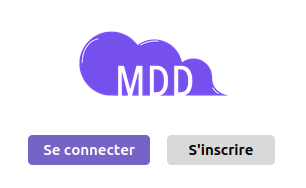
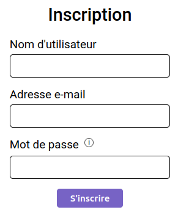
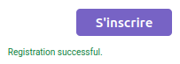
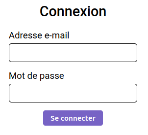
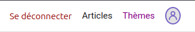
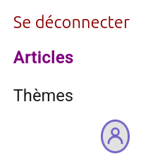
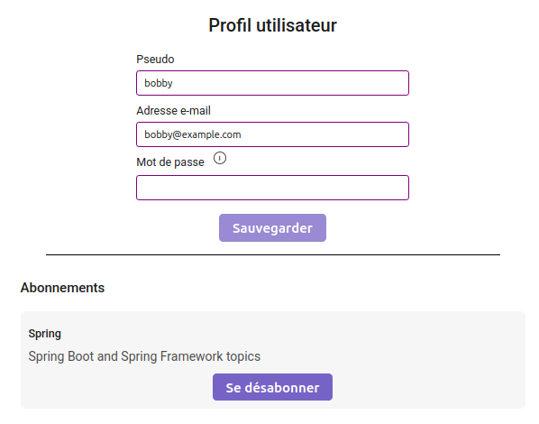
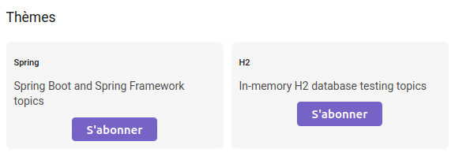
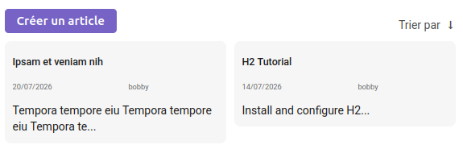
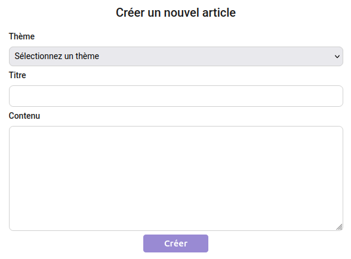

# FAQ

## Créer un compte

1. Accéder à la page d'accueil  

1. Cliquer sur "S'inscrire"
1. Remplir le formulaire  

1. Le mot de passe doit respecter le format suivant et contenir
    - 8 caractères minimum
    - au moins un chiffre
    - au moins une minuscule
    - au moins une majuscule
    - un caractère parmi `=+_-$#!?`
1. Cliquer sur S'inscrire
1. Un message de confirmation s'affiche  

## Se connecter

1. Accéder à la page d'accueil  

1. Cliquer sur `Se connecter`
1. Saisir votre email et votre mot de passe  

1. Cliquer sur `Se connecter`

## Se déconnecter

1. Se connecter
1. Dans le menu cliquer sur `Se déconnecter`  

## Accéder au menu sur mobile

1. Se connecter
1. Cliquer sur le burger  

1. Le menu s'affiche  

## Modifier ses informations

1. Se connecter
1. Dans le menu cliquer sur l'icone de droite pour accéder à votre  profil  

1. Sur votre page de profil, modifier vos informations et cliquez sur  `Sauvegarger`  

## S'inscrire à un thème

1. Se connecter
1. Dans le menu cliquer sur `Thèmes` pour accéder à la liste des thèmes

1. Cliquer sur `S'abonner` pour s'abonner à un thème

## Se désinscrire d'un thème

1. Se connecter
1. Dans le menu cliquer sur l'icone de droite pour accéder à votre  profil  

1. Sur votre page de profil, cliquer sur `Se désabonner` sur le thème souhaité  

## Consulter mon feed

1. Se connecter
1. Dans le menu cliquer sur `Articles`  

1. Les articles concernant les thèmes auxquels vous êtes inscrit s'affichent  

> Il est possible de trier les articles par date de parution en cliquant sur `Trier par`

## Créer un article

1. Consulter votre feed

1. Cliquer sur `Créer un article`
1. Remplir le formulaire et cliquer sur `Créer`  

