# Documentation et rapport du projet MDD

## Présentation générale du projet

### Objectifs du projet

L'entreprise ORION souhaite créer un réseau social pour développeurs nommé Monde de Dev ( MDD ).

Nous commencerons par la réalisation d'un MVP déployé en interne.

Les fonctionnalités de bases sont :

- création de compte / connexion
- création / visualistaion d’articles
- visualisation / inscription à des thèmes

### Périmètre fonctionnel

| Fonctionnalités | Description | Statut |
| --- | --- | --- |
| Création d’un compte utilisateur | Formulaire et validation d’inscription | ✅  |
| Connexion et authentification | Formulaire de connexion + token JWT | ✅  |
| Déconnexion | Suppression du token JWT | ✅  |
| Gestion du profil | Formulaire de modification | ✅  |
| Gestion des abonnements | Abonnement et désabonnement aux thèmes | ✅  |
| Gestion des articles | Création, visualisation | ✅  |
| Commentaires | Ajout de commentaire sur un article | ✅  |

## Architecture et conception technique

### Schéma global de l'architecture

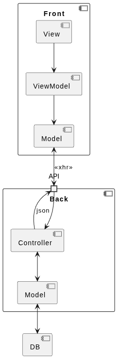

- Le back ( java spring ) 
    - communique avec la BDD
    - architecture MVC
    - expose une API
- Le front ( Angular 20 )
    - récupère les données via les endpoints de l’API
    - affiche les interfaces

### Choix techniques

#### Back

liste des dépendances installées

| Techno | Type | Lien documentation | Objectif du choix | Justification |
| --- | --- | --- | --- | --- |
| java 21 | langage de programmation | [doc oracle](https://docs.oracle.com/en/java/javase/21/docs/api/index.html) |  | version LTS répandue dans l'entreprise |
| maven | build tool | [doc maven](https://docs.spring.io/spring-boot/maven-plugin/index.html) | N/A | build tool standard |
| springboot  | framework | [doc spring](https://spring.io/) | rapidité / fiabilité du code | les composants s'ajoutent en fonction des besoins |
| spring web MVC | architecture MVC | [doc spring web](https://docs.spring.io/spring-framework/reference/web/webmvc.html) | ensemble d'utilitaires pour une application web | composant spring |
| spring security | composant spring qui gère la sécurité de l'application (authent, author) | [doc spring security](https://docs.spring.io/spring-security/reference/index.html) | sécurisation de l'application | composant spring |
| Java JWT | bibliothèque de gestion de tokens JWT | [doc jjwt](https://github.com/jwtk/jjwt) | sécurisation de l'application | projet actif et reconnu |
| spring doc open API | composant spring qui permet de documenter l'API | [doc spring doc api](https://springdoc.org/) | documentation de l'API | composant spring |
| Validation | intégration du validator hibernate | [doc hibernate validator](https://docs.hibernate.org/stable/validator/reference/en-US/html_single/) | validation des données | wrapper intégré à spring |
| spring data | composant spring qui gère la connexion à une source de données | [doc spring data](https://docs.spring.io/spring-data/jpa/reference/index.html) | persistance des données | composant spring |
| MySQL Driver | Pilote de connexion à une BDD MySQL | NA, utilisé par spring data | persistance des données | Système de BDD répandu dans l'entreprise |
| H2 Database | Pilote de connexion à une BDD en mémoire H2 | NA, utilisé par spring data | persistance des données en tests | rapidité des tests unitaires |

#### Front

| Techno | Type | Lien documentation | Objectif du choix | Justification |
| --- | --- | --- | --- | --- |
| Angular 14 | langage de programmation | [doc angular 14](https://v14.angular.io/docs) |  | version disponible bootstrap |
| Cypress | Qualité | [doc cypress](https://docs.cypress.io/app/get-started/why-cypress) | outils testing e2e | interface intuitive |
| Karma | Qualité | [doc karma](https://karma-runner.github.io/latest/index.html) | runner de test | créé par l'équipe angular |
| Jasmine | Qualité | [doc jasmine](https://jasmine.github.io/index.html) | framework de test | simplicité  |

### API et schémas de données

Toutes les routes sont préfixées par `/api/v1/`.

Seules les routes login et register ne sont pas protégées

> voir la [doc swagger](http://localhost:3001/swagger-ui.html) pour les exemples de requetes

| url | verbe http | description | remarques |
| --- | --- | --- | --- |
| ✅ auth/register | POST | enregistre un utilisateur | NA |
| ✅ auth/login | POST | log un utilisateur | un token d'authentification est renvoyé |
| ✅ me | GET | récupère les informations de l'utilisateur connecté | NA |
| ✅ me | PUT | modifie les informations de l'utilisateur connecté | NA |
| ✅ topic | GET | récupère la liste des thèmes | chaque topic contient un champ registered qui vaut true si l'utilisateur connecté est inscrit à ce topic |
| ✅ subscription/{topic_id}/ | POST | abonne l'utilisateur connecté au topic dont l'id est fourni | NA |
| ✅ subscription/{topic_id} | DELETE | désabonne l'utilisateur connecté au topic dont l'id est fourni | NA |
| ✅ feed?sort=ASC | GET | récupère les articles correspondant aux thèmes du profil | réponse triable en ajoutant le paramètre sort (DESC par défaut) |
| ✅ post | POST | ajoute un article | l'auteur est l'utilisateur connecté |
| ✅ post/{post_id} | GET | récupère les informations de l'article dont l'id est fourni | les commentaires sont à récupérés sur une autre route  |
| ✅ post/{post_id}/comment | GET | récupère la liste des commentaires pour l'article dont l'id est fourni  | NA |
| ✅ post/{post_id}/comment | POST | ajoute un commentaire sur l'article dont l'id est fourni. l'utilisateur du commentaire est l'utilisateur connecté | NA |

#### Modelisation BDD

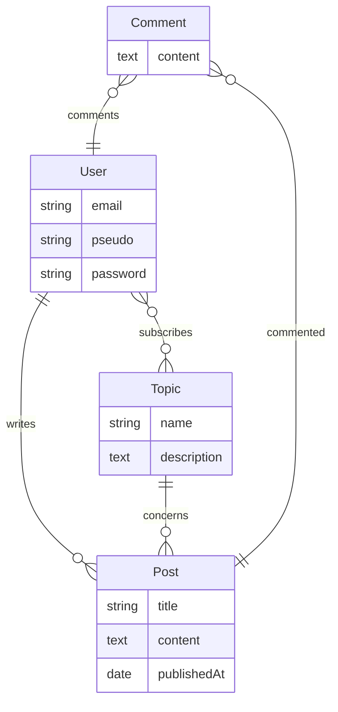

## Tests, performance et qualité

### Stratégie de test

| Type de test | Outils | Portée | Résultats |
| --- | --- | --- | --- |
| Tests unitaires Front | Jasmine + Karma | pages, services et components | 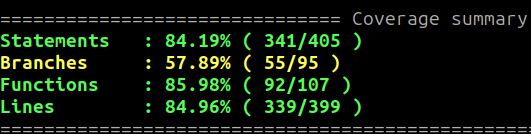 |
| Tests unitaires Back | SpringBootTest + Junit + Mockito | pages, services et components | 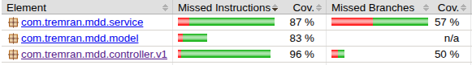 |
| Tests E2E | Cypress | Use Cases | 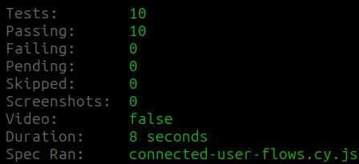 |

### Rapport de performance et optimisation

- lighthouse  
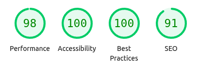
- PMD `pmd check -d ./src/main -R rulesets/java/quickstart.xml -f text` : pas de warning

### Revue technique

- points forts :
    - structure MVC => modularité, extensibilité
- à améliorer :
    - pagination sur la liste des articles et liste des commentaires
    - intégrer l'analyse de code avec PMD dans les commandes ( pre commit par exemple )

## Documentation utilisateur et supervision

### FAQ utilisateur

Voir [la FAQ](./faq/faq.md)

### Supervision et tâches déléguées à l'IA

| Tâche déléguée | Objectif | Vérification effectuée |
| --- | --- | --- |
| génération de la configuration à mysql | gain de temps | vérification des logs lors du build |
| génération du script du schema de BDD | gain de temps | relecture, modification et exécution du script en ligne de commande |
| génération des entités | gain de temps | relecture |
| migration angular 14 > 20 | aide au développement | application des étapes, l'application est migrée |
| aide au debug | aide au développement | le bogue est résolu |

exemple de demandes :

- `connect this app to the mysql database mdd_user:mdd_pwd@p05_mdd`
- `generate mysql script to match the mermaid diagram`
- `Génère les entités correspondant au script sql suivant`
- `Je dois migrer cette application angular 14 vers angular 20, quelles sont les étapes à suivre`
- `j'ai une erreur de compilation peux tu vérifier`

## Annexes

### UI

#### Home page

- desktop  
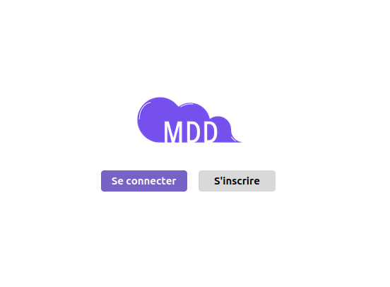
- mobile  
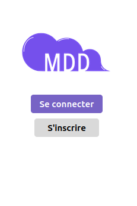

#### Register

- desktop  
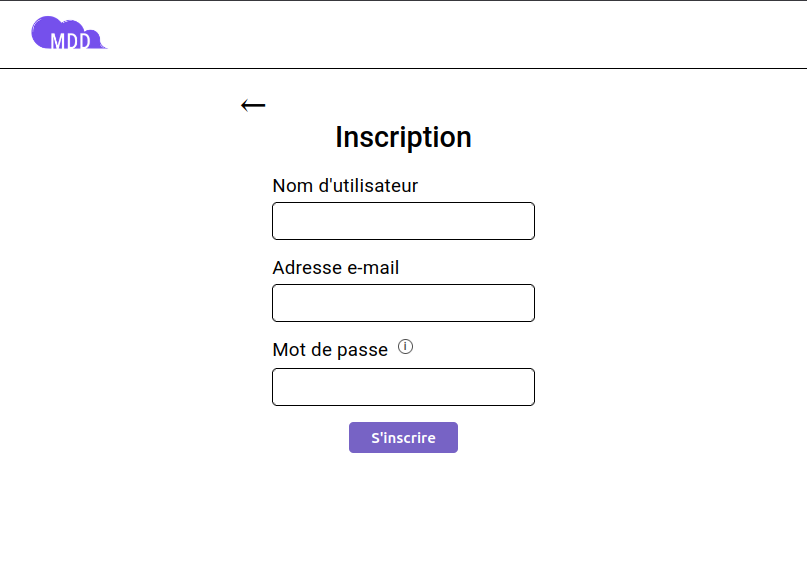
- mobile  
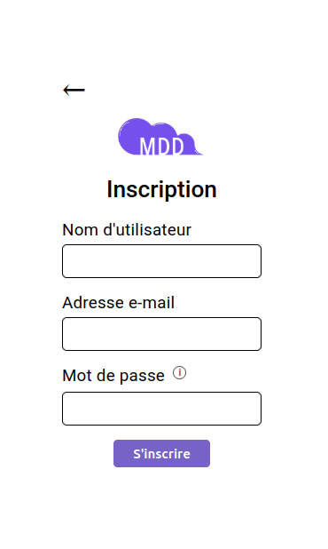

#### Login

- desktop  
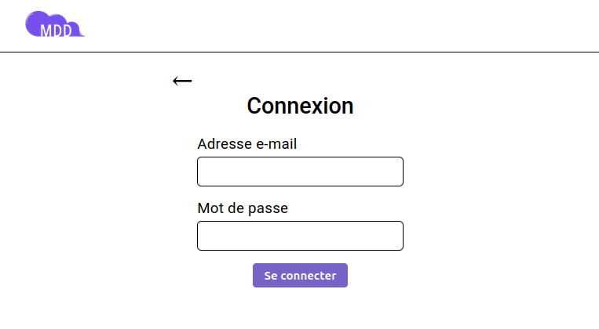
- mobile  
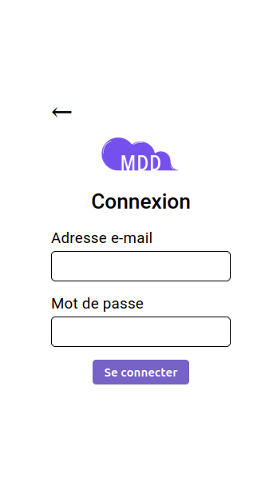

#### feed

- desktop  
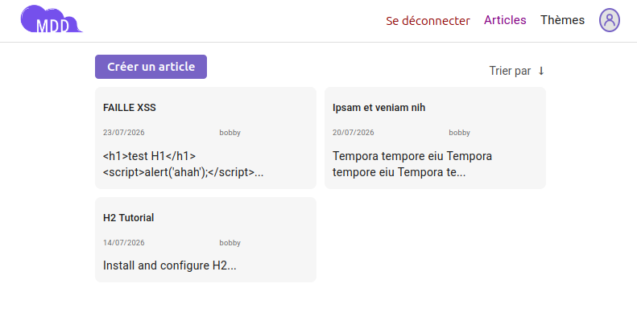
- mobile  
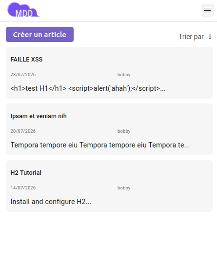

#### nouvel article

- desktop  
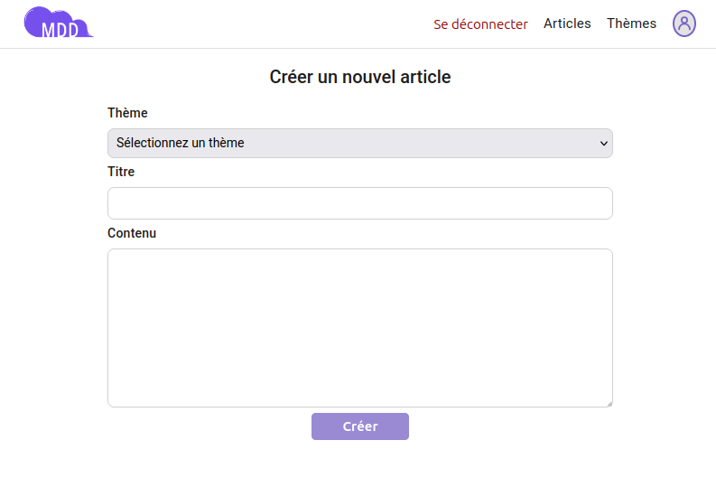
- mobile  
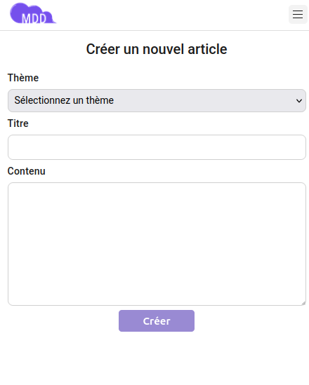

#### Thèmes

- desktop  
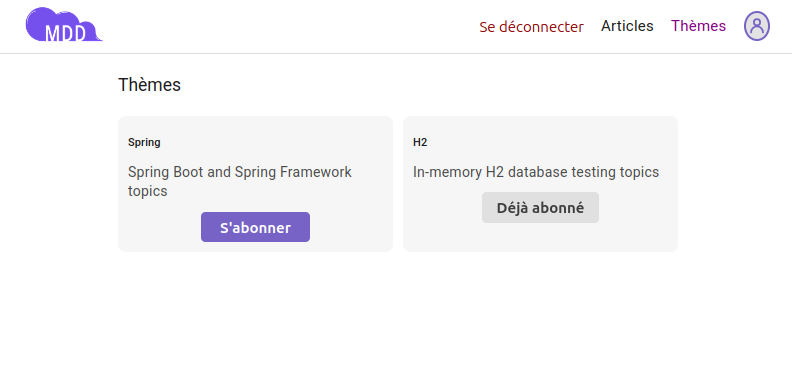
- mobile  
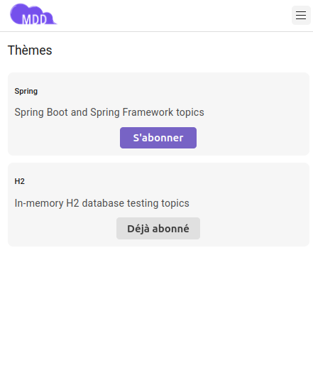

#### Profil

- desktop  
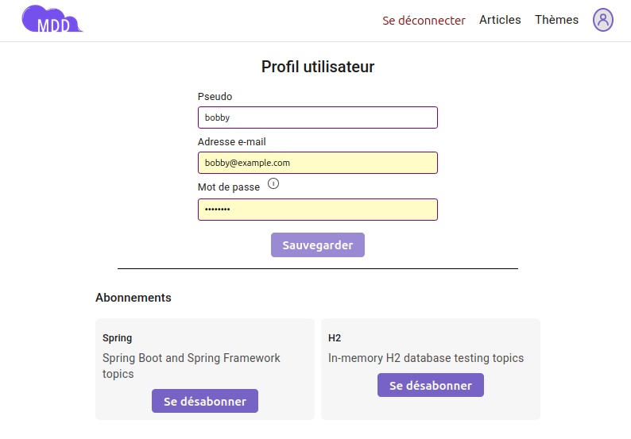
- mobile  
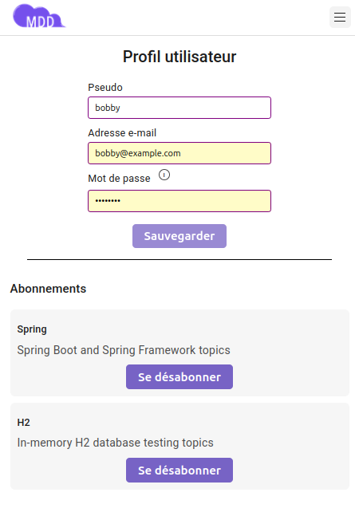